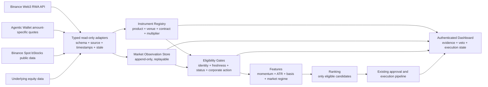

# 三个 bStocks 项目深度分析与本系统升级方案

日期：2026-07-31
目标系统：`binance-agentic-stock-bot`
分析对象：

1. [`zhuangzmr/bstocks-live-dashboard`](https://github.com/zhuangzmr/bstocks-live-dashboard/tree/26217c18643b3490d91a93644c3e04da806eefca)
2. [`zhuangzmr/bstocks-live-widget`](https://github.com/zhuangzmr/bstocks-live-widget/tree/7f62984ac25237d858fcd13c10f81ff673122014)
3. [`zhuangzmr/binance-bstocks-equity-research`](https://github.com/zhuangzmr/binance-bstocks-equity-research/tree/517b946423659843da77f421eba54f6d5f1e95b2)

## 1. 执行结论

三个项目能给当前系统带来明显提升，但正确做法不是把它们直接合并进交易机器人，而是提取三类能力：

- 从 `bstocks-live-dashboard` 提取可靠行情数据面的设计：REST 快照、WebSocket 增量、备用官方节点、短缓存、过期标记、批量请求和面向机器的只读 API。
- 从 `bstocks-live-widget` 提取终端可靠性与轻量交互设计：断线重连、恢复后重新校准、事件时间去重、150ms 批量刷新、前后台恢复和只读桌面监控。
- 从 `binance-bstocks-equity-research` 提取研究与风控契约：产品身份门禁、来源与时间证据、严格价格归一化、硬否决优先、评分与置信度分离、数据不足时拒绝推荐。

当前系统已经具备很强的执行安全能力：金额相关的 Agentic Wallet 买卖报价、报价新鲜度和漂移检查、Gas/滑点/往返成本、ATR 风控、不可变审批、订单意图先落盘、紧急停止、Shadow、回放及 180 项通过测试。升级应保留这些能力，不改写现有订单提交语义。

最重要的新增能力是：

> 在“策略计算”之前增加一个带证据的产品身份与数据质量层；在 Dashboard 中把“执行价格、参考价格、产品身份、数据时效、否决原因”放在同一条可追溯链路上。

这会直接降低四类风险：

1. 把 Binance Spot bStock、Binance Web3 BSC RWA、Ondo 或其他发行人的同名代币混为同一资产。
2. 在 multiplier、合约、公司行动或市场状态变化后继续使用旧映射。
3. 把陈旧参考价、休市价格或不同时间点价格误判为可执行折价。
4. 让高策略分数掩盖身份、数据、流动性或公司行动硬风险。

## 2. 产品边界：必须先解决的关键问题

当前系统和前两个项目读取的并不是同一交易通道。

| 维度 | 当前系统 | Dashboard / Widget 项目 |
| --- | --- | --- |
| 主要场所 | Binance Web3、BSC、Agentic Wallet | Binance Spot |
| 标的解析 | Web3 RWA 列表中的 ticker 和 BSC 合约 | `NVDABUSDT`、`TSLABUSDT` 等 Spot pair |
| 执行价格 | Agentic Wallet 指定金额的买入/卖出 quote | Spot 最新成交、ticker、盘口 |
| 参考结构 | `stockInfo.price × sharesMultiplier` | Spot bStock 自身 USDT 价格 |
| 交易动作 | BSC swap | 项目本身只读，不下单 |
| 流动性证据 | 指定金额 quote 的实际输出 | Spot order book、trades、24h volume |

因此：

- Spot bStock 价格可以作为交叉市场观察和异常检测输入。
- Spot order book 不能替代当前 BSC swap 的指定金额 quote。
- `NVDABUSDT` 不能仅凭名称映射为当前 Web3 `NVDA` 合约。
- Dashboard 项目的静态资产表不能成为当前机器人产品身份或交易资格的来源。
- 任何跨场所价差必须明确标注为 `CROSS_VENUE_OBSERVATION`，不能直接称为套利。

建议在数据模型中显式增加：

```json
{
  "productType": "binance_web3_rwa | binance_bstock_spot | ondo_tokenized_equity | unknown",
  "executionVenue": "binance_agentic_wallet_bsc | binance_spot | none",
  "marketDataVenue": "binance_web3 | binance_spot | external_equity",
  "chainId": "56",
  "contractAddress": null,
  "spotSymbol": null,
  "underlyingTicker": "NVDA"
}
```

只有 `productType + executionVenue + 标识符` 完整匹配，数据才可以进入执行路径。

## 3. 项目一：bstocks-live-dashboard

### 3.1 实际架构

该项目不是单纯的 React 页面，包含三层：

1. React/Vite 行情界面。
2. 浏览器直接访问 Binance Spot REST 和 WebSocket 的实时数据层。
3. Python 本地服务提供静态文件、自选同步和面向 AI/程序的只读行情 API。

关键实现：

- [`src/lib/binance.js`](https://github.com/zhuangzmr/bstocks-live-dashboard/blob/26217c18643b3490d91a93644c3e04da806eefca/src/lib/binance.js) 配置五个 REST 节点和三个 WebSocket 节点，记住最近成功的 REST 节点。
- [`src/hooks/useMarketData.js`](https://github.com/zhuangzmr/bstocks-live-dashboard/blob/26217c18643b3490d91a93644c3e04da806eefca/src/hooks/useMarketData.js) 使用 REST 快照初始化，订阅 `@ticker` 与 `@trade`，按事件时间拒绝倒序数据，并每 150ms 批量刷新 React 状态。
- [`src/hooks/useSymbolStream.js`](https://github.com/zhuangzmr/bstocks-live-dashboard/blob/26217c18643b3490d91a93644c3e04da806eefca/src/hooks/useSymbolStream.js) 为单个标的同时维护 K 线、盘口、成交与 ticker；重连后重新请求 K 线和成交，避免断线区间形成数据空洞。
- [`scripts/local-server.py`](https://github.com/zhuangzmr/bstocks-live-dashboard/blob/26217c18643b3490d91a93644c3e04da806eefca/scripts/local-server.py) 提供短 TTL 缓存、节点切换和最多五分钟的 stale fallback，并把 `source`、`generatedAt`、`stale` 放入响应。
- [`public/openapi.json`](https://github.com/zhuangzmr/bstocks-live-dashboard/blob/26217c18643b3490d91a93644c3e04da806eefca/public/openapi.json) 定义 catalog、market、quote、klines、order book、trades 和 analysis 接口。

### 3.2 最有价值的设计

#### A. 快照与增量分离

先用 REST 建立完整状态，再用 WebSocket 更新；断线恢复后重新拉取快照。这比只依赖流或只轮询更可靠。

对当前系统的价值：

- Bot 继续按 15 分钟扫描和 1 分钟持仓监控，不必改为由 WebSocket 驱动。
- Dashboard 可以增加独立实时市场上下文，不再只能等待 Bot 下一次扫描写入 signal history。
- WebSocket 中断不会改变交易状态，恢复后只校准读模型。

#### B. 事件时间优先

项目在合并 REST 与 WebSocket 数据时比较 `eventTime`，避免较晚到达的旧消息覆盖新值。

当前系统的 `market-data-recorder` 记录 `recordedAt`，但执行数据契约没有统一区分：

- 数据真正生效的 `effectiveAt`
- 系统收到数据的 `retrievedAt`
- 本地落盘的 `recordedAt`

补齐这三个时间可以显著提升回放可信度，并减少把网络到达时间当市场时间的问题。

#### C. 上游来源、短缓存和 stale fallback

Python 服务会：

- 优先使用最近成功节点；
- 为 ticker、K 线和盘口设置不同短 TTL；
- 上游全部失败时最多返回五分钟缓存；
- 明确返回 `stale: true`。

当前 Bot 对 Web3 私有 BAPI 使用统一重试，但没有统一的数据响应信封，也没有可被策略识别的 stale 状态。值得移植的是“来源和时效契约”，不是照搬 Python 服务。

#### D. 面向机器的聚合接口

`/api/public/analysis` 一次返回报价、K 线和技术指标，避免每个消费者重复抓取和计算。

当前 Dashboard 的 `/api/snapshot` 主要读取 Bot 状态和审计记录。可以新增内部只读研究接口，把产品、数据质量、basis 和市场上下文统一输出，供 Dashboard、报告和 Codex 使用。

### 3.3 局限与不可直接复制的部分

- 资产目录是静态的 27 个 symbol，其中包含 BTC、BNB 和 25 个 bStocks；项目自身也承认它不能证明当前完整 universe。
- 前端和服务端各维护一份静态目录，存在漂移风险。
- 仓库没有自动化测试脚本；本次 `npm ci && npm run build` 成功，但这只证明可以构建。
- Spot ticker 的滚动 24 小时涨跌不是美股交易日收益。
- 最后成交价、Spot order book 与 BSC 指定金额 swap quote 不是同一执行价格。
- 公开 API 的 `Access-Control-Allow-Origin: *` 适合只读公共服务，不应套到当前带审批、钱包恢复和紧急停止的认证 Dashboard。

### 3.4 应提取到当前系统的能力

| 能力 | 建议落点 | 是否进入执行门禁 |
| --- | --- | --- |
| REST 节点切换 | `src/adapters/binance-spot-market.mjs` | 否，先做参考数据 |
| 快照 + WebSocket 增量 | 独立 Dashboard 市场读模型 | 否 |
| event time 去重 | 统一 market observation schema | 是，所有价格比较必须使用 |
| source/stale 信封 | 所有行情适配器 | 是 |
| 只读聚合 API | Dashboard 的认证接口 | 否 |
| Spot 盘口和成交 | 跨场所观察、流动性提示 | 否，不替代 BSC quote |

## 4. 项目二：bstocks-live-widget

### 4.1 实际架构

该项目是 Electron 常驻桌面应用：

- `main.cjs` 创建始终置顶、跨桌面空间、托盘常驻的窗口。
- 渲染进程禁用 Node integration，启用 context isolation 和 sandbox。
- `widget.js` 直接访问 Binance Spot REST/WebSocket。
- 自选列表保存在 localStorage，并与 Dashboard 的本地偏好接口每两秒同步。

本次验证：

- `npm ci` 成功。
- Electron arm64 打包成功。
- `npm audit` 报告一个间接依赖 `brace-expansion` 的 high severity 漏洞。
- 仓库没有自动化测试。

### 4.2 最有价值的设计

#### A. 重连状态机

Widget 显式区分：

- `connecting`
- `live`
- `reconnecting`
- `offline`

重连使用指数退避、上限 30 秒和随机抖动。每次重连前先重新拉取 REST 快照。

当前 Dashboard 健康状态偏向 Bot、钱包和订单状态。可以新增独立的数据依赖状态：

```text
BOT_HEALTH
WALLET_HEALTH
WEB3_MARKET_DATA_HEALTH
SPOT_REFERENCE_DATA_HEALTH
UNDERLYING_REFERENCE_HEALTH
```

这样“机器人运行正常但参考数据已离线”不会被一个总的 RUNNING 状态掩盖。

#### B. 高频事件批量渲染

Widget 不为每条成交立即做完整界面更新，而是通过定时批处理更新视图。Dashboard React 版本也使用 150ms flush。

如果当前 Dashboard 增加实时行情，必须沿用这一点，否则多 symbol 的 `@trade` 会造成无意义重绘。现有三秒 `/api/snapshot` 轮询可以继续负责交易状态；实时市场流应是独立、可丢弃、只读的 UI 数据源。

#### C. 恢复和重新显示时校准

Widget 在网络恢复、窗口重新显示或用户手动刷新时重新获取快照。这种“恢复时校准”适合 Dashboard 的市场读模型，不应触发 Bot 交易周期。

#### D. Electron 安全边界

`contextIsolation: true`、`nodeIntegration: false`、`sandbox: true` 是正确的桌面 UI 边界。外部链接只交给系统浏览器。

### 4.3 局限与不可直接复制的部分

- Widget 与 Dashboard 重复维护静态 symbol 列表。
- 自选同步使用轮询和“更新时间较新者覆盖”，适合单用户本地偏好，不适合交易控制状态。
- localStorage 不能作为交易配置、产品身份或审计证据。
- 捕获并忽略单条格式错误适合只读 UI；执行路径应记录 schema 错误并失败关闭。
- 引入 Electron 会扩大依赖和攻击面，而当前系统已经有 Web Dashboard，不需要再引入第二个生产控制终端。
- 当前依赖树存在一个 high severity 间接漏洞，不能原样引入生产环境。

### 4.4 应提取到当前系统的能力

建议只提取可靠性模式，不引入 Electron：

- 数据依赖状态机；
- 指数退避与抖动；
- 恢复时快照校准；
- 事件时间去重；
- 150ms UI 批处理；
- 页面切回前台时重新同步；
- 市场流和交易控制流隔离。

## 5. 项目三：binance-bstocks-equity-research

### 5.1 实际架构

该项目由三部分组成：

1. `SKILL.md` 定义严格的只读研究流程。
2. `scripts/bstock_research/` 提供可组合的确定性 Python 模块。
3. `tests/` 使用 fixtures 验证身份、数据、归一化、比较、评分、仓位和报告。

本次验证结果：

- 53 项 pytest 全部通过。
- Ruff 检查通过。
- mypy strict 检查 18 个源文件通过。

它不是可直接下单的策略，也不是完整数据供应商。其最大价值是把“何时必须拒绝结论”编码成确定性契约。

### 5.2 最有价值的设计

#### A. 产品身份门禁

[`instruments.py`](https://github.com/zhuangzmr/binance-bstocks-equity-research/blob/517b946423659843da77f421eba54f6d5f1e95b2/scripts/bstock_research/instruments.py) 明确规定：

- 本地静态 catalog 只能作为候选 seed；
- `exchangeInfo` 只能证明 Spot pair 存在，不能证明发行人或产品类型；
- 普通股票 ticker 可能对应多个产品，不能自动确认；
- 必须具备当前交易所数据和官方产品 metadata，才能确认身份；
- Ondo 或其他产品不能被当作 Binance bStock；
- 身份不完整时输出 `DO_NOT_TRADE`。

当前系统每个 entry cycle 都从官方 Web3 RWA 列表解析 BSC 合约，这一点已经正确；缺口是没有形成可持久、可比较的 instrument snapshot，也没有在合约、multiplier 或产品类型变化时生成独立硬否决原因。

#### B. 数据证据模型

项目为关键事实保存：

- `source`
- `source_type`
- `retrieved_at`
- `effective_at`
- `freshness`
- `confidence`
- `conflicting_sources`
- 派生公式和输入

当前系统的 trace 很完整，但“操作审计”不等于“市场事实证据”。例如当前 basis 计算已经使用指定金额买入 quote、`stockInfo.price` 和 `sharesMultiplier`，但记录中还缺少统一的：

- 底层价格有效时间；
- multiplier 有效时间；
- 价格与 multiplier 的来源；
- 两边时间差；
- 底层市场是否开放；
- 参考价是否陈旧；
- 是否发生来源冲突。

#### C. 严格的价格归一化与比较

[`comparison.py`](https://github.com/zhuangzmr/binance-bstocks-equity-research/blob/517b946423659843da77f421eba54f6d5f1e95b2/scripts/bstock_research/comparison.py) 处理：

- 两种 multiplier 方向；
- bStock 与底层价格币种；
- 有来源、置信度和时间的 FX；
- 时间对齐；
- 底层市场开放状态；
- 指定金额盘口吃单与深度不足；
- 溢折价和可否声称套利。

当前系统的优势是已经使用 Agentic Wallet 指定金额 quote，而不是假设 Spot maker fill。升级重点不是改用项目的 Spot depth 算法，而是把当前 quote 放进同样严格的比较契约。

建议统一公式：

```text
fairTokenPrice = underlyingPrice × sharesMultiplier
executableBuyPrice = inputUSDT / quotedTokenQuantity
grossBasisPct = (fairTokenPrice / executableBuyPrice - 1) × 100
netBasisPct = grossBasisPct - allInCostPct
```

但只有以下条件同时满足，`netBasisPct` 才可进入策略：

- 身份确认；
- multiplier 有来源、方向和时间；
- 底层价格与 token quote 时间对齐；
- 底层市场开放或明确标记休市；
- quote 新鲜且金额匹配；
- 无未解决公司行动；
- 数据来源无关键冲突。

#### D. 硬否决优先于评分

[`scoring.py`](https://github.com/zhuangzmr/binance-bstocks-equity-research/blob/517b946423659843da77f421eba54f6d5f1e95b2/scripts/bstock_research/scoring.py) 先执行 veto，再计算标签。重要 veto 包括：

- `INSTRUMENT_UNVERIFIED`
- `DATA_INSUFFICIENT`
- `TRADING_PAUSED`
- `CORPORATE_ACTION_UNRESOLVED`
- `LIQUIDITY_TOO_LOW`
- `PREMIUM_DISCOUNT_ABNORMAL`
- `DO_NOT_TRADE`

当前 `rankCandidates()` 已经先过滤市场、趋势和成本门槛，再排序，这是正确基础。建议进一步把结果拆成：

```json
{
  "eligibility": {
    "allowed": false,
    "vetoReasons": ["MULTIPLIER_STALE"]
  },
  "ranking": {
    "score": null,
    "components": []
  },
  "confidence": {
    "score": 62,
    "label": "LOW"
  }
}
```

被硬否决的标的不能因为 momentum 或 basis 分数高而重新进入排名。

#### E. 数据质量和置信度与收益预测分离

该项目把 `confidence_score` 定义为证据完整性和一致性，而不是预期收益。这一点应进入当前 Dashboard。

当前系统可以同时展示：

- `signalStrength`：策略信号强弱；
- `executionEdge`：成本后的可执行余量；
- `dataQuality`：数据完整性和时效；
- `confidence`：证据一致性；
- `vetoReasons`：硬阻止原因。

避免用一个“综合分”混合四种不同含义。

### 5.3 局限与不可直接复制的部分

- 配置中的评分权重和阈值是研究默认值，不是当前系统已经验证的交易参数。
- 基本面、宏观、估值和事件模块不应进入每分钟执行热路径。
- 项目自身不会自动取得全部官方产品 metadata；它会在证据不足时拒绝。
- Python 子系统会增加双语言运行和部署复杂度。
- 对当前机器人最适合移植的是数据契约、验证逻辑和测试场景，不是直接启动一套 Python 交易旁路。

## 6. 当前系统的优势与缺口

### 6.1 必须保留的优势

| 已有能力 | 当前证据 | 升级要求 |
| --- | --- | --- |
| 每周期解析官方 BSC RWA 合约 | `resolveAssets()` | 保留，并持久化身份快照 |
| 指定金额双向 quote | `buildCandidate()` | 继续作为执行成本权威 |
| 报价新鲜度与漂移复核 | 预提交 revalidation | 不放宽 |
| Gas、滑点、往返成本 | `costCoverageDecision()` | 纳入统一 provenance |
| ATR、止损、追踪退出 | 策略与退出模块 | 不由新评分覆盖 |
| 不可变审批 | approval decisions | 不与 UI 偏好同步混合 |
| 订单意图先落盘 | reliability/replay | 不改变提交一次语义 |
| Shadow 与严格 quote replay | backtest/replay | 作为升级验收渠道 |
| 审计、紧急停止、钱包状态 | Bot + Dashboard | 保持执行优先级最高 |

### 6.2 主要缺口

| 缺口 | 当前影响 | 优先级 |
| --- | --- | --- |
| Web3、Spot bStock、Ondo 等产品缺少统一且明确的 identity model | 同 ticker 数据可能被错误关联 | P0 |
| Web3 BAPI 调用直接写在 `bot.mjs` | schema、来源、时效和 fallback 难以独立测试 | P0 |
| 市场记录缺少统一 `source/effectiveAt/retrievedAt/freshness` | 回放无法完整证明当时知道什么 | P0 |
| basis 比较缺少显式时间对齐和 multiplier provenance | 折价可能来自陈旧或错位参考值 | P0 |
| 配置 universe 是静态 allowlist，发现与准入没有分层 | 新标的不可见，旧标的变化主要表现为错误 | P1 |
| Dashboard 缺少产品身份、数据源和 stale 状态 | 操作员看到结果但难以判断证据质量 | P1 |
| Bot Dashboard 只看到扫描时快照，缺少独立实时市场上下文 | 两次扫描之间观察能力不足 | P2 |
| 数据质量、置信度、信号强度和可执行余量未完全分离 | 容易把策略强度误读成证据可靠性 | P1 |
| 前端若直接加入高频流，缺少专用批量刷新路径 | 可能增加渲染开销 | P2 |

## 7. 目标架构



原则：

- 适配器只负责取数、验证 schema 和建立证据。
- Instrument Registry 负责确认“它是什么”，不负责判断“是否值得买”。
- Eligibility Gates 负责“能否进入策略”，不参与收益评分。
- Features 和 Ranking 只处理已经通过硬门禁的候选。
- Spot 和底层股票数据默认只读，不具备交易权限。
- 现有 Agentic Wallet quote 继续作为 BSC 执行价格权威。

## 8. 分阶段升级方案

### 阶段 A：产品身份与数据证据层（P0）

建议新增：

- `src/instrument-registry.mjs`
- `src/market-observation.mjs`
- `src/data-quality.mjs`
- `src/adapters/binance-web3-rwa.mjs`
- `test/instrument-registry.test.mjs`
- `test/market-observation.test.mjs`
- `test/binance-web3-rwa-adapter.test.mjs`

实施内容：

1. 把 `resolveAssets()`、`assetStatus()`、`rwaDynamic()` 和 K 线读取从 `bot.mjs` 移到只读适配器。
2. 对每个上游响应做字段和数值验证；缺字段时返回明确错误码，不让 `undefined` 进入策略。
3. 每个 instrument 保存：
   - 产品类型；
   - ticker、底层 ticker；
   - chain ID、contract；
   - execution venue；
   - multiplier 及方向；
   - trading/asset status；
   - source、effectiveAt、retrievedAt、freshness。
4. 每周期比较上一版身份：
   - contract 变化；
   - multiplier 变化；
   - 产品类型变化；
   - 状态从 trading 变 paused；
   - 公司行动 reason code。
5. 变化未经确认时产生硬否决：
   - `CONTRACT_CHANGED`
   - `MULTIPLIER_CHANGED`
   - `PRODUCT_TYPE_CHANGED`
   - `CORPORATE_ACTION_UNRESOLVED`
   - `INSTRUMENT_UNVERIFIED`
6. 将 instrument snapshot 写入 append-only 市场记录，并生成 `state/instruments/latest.json` 供 Dashboard 只读展示。

验收条件：

- 同一 ticker 的 Spot bStock 和 BSC RWA 永远得到不同 instrument ID。
- 普通 ticker 不能单独确认产品身份。
- contract 或 multiplier 改变会阻止新开仓，但不停止已有持仓的保护性退出。
- 适配器 schema 错误不会退化成零值。
- 现有订单提交、审批和退出测试保持通过。

### 阶段 B：严格 basis 与数据质量门禁（P0/P1）

建议新增：

- `src/basis-observation.mjs`
- `src/eligibility-gates.mjs`
- `test/basis-observation.test.mjs`
- `test/eligibility-gates.test.mjs`

实施内容：

1. 把当前 basis 输入固化为一个不可变 observation：

```json
{
  "instrumentId": "binance_web3_rwa:56:0x...",
  "executableBuy": {
    "inputUsdt": "50",
    "outputToken": "...",
    "unitPrice": "...",
    "effectiveAt": "...",
    "retrievedAt": "...",
    "source": "agentic_wallet_quote"
  },
  "underlying": {
    "price": "...",
    "currency": "USD",
    "marketOpen": true,
    "effectiveAt": "...",
    "source": "binance_web3_rwa_dynamic"
  },
  "multiplier": {
    "value": "...",
    "basis": "underlying_shares_per_token",
    "effectiveAt": "...",
    "source": "binance_web3_rwa_dynamic"
  },
  "timeGapMs": 0,
  "grossBasisPct": 0,
  "allInCostPct": 0,
  "netBasisPct": 0,
  "vetoReasons": []
}
```

2. 若上游暂时不给底层价格或 multiplier 的有效时间，先标记 `TIME_PROVENANCE_INCOMPLETE`，在 Shadow 中记录，不直接扩大 Live 语义。
3. 休市时只记录 `REFERENCE_MARKET_CLOSED`，不把偏差称为套利。
4. 继续使用当前指定金额双向 quote 计算真实往返成本。
5. 将以下概念分开：
   - `eligibility.allowed`
   - `vetoReasons`
   - `signalStrength`
   - `executionEdge`
   - `dataQuality`
   - `confidence`
6. `rankCandidates()` 只接收 `eligibility.allowed === true` 的候选。

验收条件：

- 时间不对齐、multiplier 不明、参考市场关闭、quote 过期都有独立结果。
- 高 momentum 或高 gross basis 不能覆盖任何硬否决。
- 相同输入生成确定性相同结果。
- 回放能证明每个 basis 结论使用了哪些原始事实。

### 阶段 C：动态发现与 allowlist 分层（P1）

实施内容：

1. 保留 `config.symbols` 作为 Live allowlist，不自动扩大真实交易范围。
2. 每个 regular-session scan 先读取当前官方 RWA universe。
3. 将标的分成：
   - `LIVE_ALLOWED`：官方发现且在配置 allowlist；
   - `RESEARCH_ONLY`：官方发现但未在 allowlist；
   - `CONFIG_MISSING`：配置存在但官方列表缺失；
   - `IDENTITY_CHANGED`：仍存在但身份关键字段变化。
4. `RESEARCH_ONLY` 只记录行情和 Shadow 结果，不进入审批或下单。
5. Dashboard 显示 universe diff，避免新产品完全不可见。

验收条件：

- 新增官方标的不产生真实下单资格。
- 配置标的从官方列表消失时，阻止开仓并给出明确原因。
- 单个标的异常不应让其他已验证标的失去研究可见性；Live 是否继续由门禁结果决定。

### 阶段 D：实时参考数据与 Dashboard 可观测性（P1/P2）

建议新增：

- `src/adapters/binance-spot-market.mjs`
- `src/reference-market-cache.mjs`
- Dashboard 内部只读接口：
  - `/api/instruments`
  - `/api/market-quality`
  - `/api/basis`
  - `/api/reference-market`

实施内容：

1. 参考 `bstocks-live-dashboard`：
   - REST 快照；
   - 官方节点切换；
   - WebSocket `@ticker/@trade`；
   - 事件时间去重；
   - 重连后 REST 校准；
   - 短缓存与 `stale`。
2. 参考 Widget：
   - 指数退避；
   - 连接状态；
   - 页面恢复时重新同步；
   - 150ms UI 批量刷新。
3. Spot 数据只进入 Dashboard 和 Shadow cross-venue observation。
4. Dashboard 对每个 symbol 展示：
   - 产品类型和执行场所；
   - BSC 合约与 multiplier；
   - BSC 指定金额买卖 quote；
   - 底层参考价；
   - 可选 Spot bStock 价格；
   - gross/net basis；
   - data age、source、stale；
   - veto reasons；
   - 最近一次身份变化。
5. 保留现有认证、HTTPS Origin 校验和控制接口，不开放 `Access-Control-Allow-Origin: *`。

验收条件：

- 参考行情中断不会触发交易，也不会阻止已有持仓退出。
- Dashboard 明确区分 Bot、钱包、Web3 数据、Spot 数据和底层参考数据健康状态。
- 高频行情不增加 Bot cycle 次数。
- UI 不把 Spot last price 标为 BSC executable price。

### 阶段 E：验证与灰度（P0-P2）

升级顺序：

1. 先新增 schema、记录和 Dashboard 展示，不改变 Live 选择结果。
2. 用 Shadow 对新旧 eligibility 同时计算，记录差异原因。
3. 回放历史记录，确认未来数据不能改变过去判断。
4. 对所有新 veto 做 fixture 测试：
   - ticker 重名；
   - contract 变化；
   - multiplier 方向错误；
   - multiplier 变化；
   - 参考市场休市；
   - quote 与底层时间错位；
   - stale fallback；
   - 上游缺字段；
   - Spot 与 BSC 场所混淆；
   - 公司行动未解决。
5. 累积足够的前向 Shadow 观测后，再决定哪些门禁进入 Live。身份、contract 和 schema 类门禁可先进入；策略分数和新阈值必须单独做样本外验证。

建议的发布门槛：

- 当前 180 项测试继续全部通过。
- 新模块单元测试、契约测试和回放测试全部通过。
- Shadow 中每个新 veto 都有可读原因和原始输入。
- 不增加任何钱包写权限。
- 不改变 `market-order swap` 只提交一次的语义。
- 不改变已有持仓的止损、止盈、追踪退出和紧急停止优先级。
- 部署时只重启受影响服务，并分别验证 Bot、Dashboard 和数据依赖健康。

## 9. 推荐优先级

| 顺序 | 升级点 | 预期收益 | 风险 |
| --- | --- | --- | --- |
| 1 | Web3 adapter 拆分 + instrument identity | 消除产品混淆和关键字段静默变化 | 低，先只读 |
| 2 | provenance + effective/retrieved/recorded 时间 | 提升回放、审计和 basis 可信度 | 低 |
| 3 | basis observation + hard veto | 防止陈旧、错位或未知 multiplier 进入策略 | 中，需要 Shadow 比较 |
| 4 | data quality / confidence / signal / edge 分离 | Dashboard 和策略解释明显提升 | 低 |
| 5 | 动态 discovery + Live allowlist 交集 | 新标的可见，Live 范围不被自动扩大 | 低 |
| 6 | Dashboard 实时参考市场读模型 | 提升两次 Bot 扫描之间的可观测性 | 中，只读隔离 |
| 7 | Spot cross-venue observation | 发现异常价差和流动性变化 | 中，不能直接执行 |
| 8 | 基本面/宏观评分 | 改善中期研究 | 高，不应进入分钟级热路径 |

## 10. 明确不建议做的事情

- 不把三个仓库整体作为依赖嵌入当前 Bot。
- 不引入 Electron 作为第二个生产控制终端。
- 不把项目静态 25 个 bStocks 清单替代当前官方 Web3 RWA 发现。
- 不把 Spot order book 替代 Agentic Wallet 指定金额 quote。
- 不把 Spot 24h 涨跌直接当美股日内收益。
- 不把研究项目的评分权重直接用于 Live。
- 不把 localStorage、自选同步或公开 CORS 设计用于审批和交易控制。
- 不因为引入实时 WebSocket 而改变 Bot 的 15 分钟 entry cadence。
- 不让参考数据故障停止已有持仓的保护性退出。
- 不在没有前向 Shadow 和回放证据时扩大自动审批或 Live symbol 范围。

## 11. 升级前后区别

| 维度 | 升级前 | 升级后 |
| --- | --- | --- |
| 产品身份 | 每周期拿官方 BSC 合约，但缺少统一身份快照和跨产品模型 | 每个产品有稳定 instrument ID，明确产品类型、场所、链、合约和底层 |
| 同 ticker 隔离 | 主要依赖调用路径和 contract | Spot bStock、BSC RWA、Ondo 和传统股票在模型层强制分离 |
| multiplier | basis 时读取并计算 | 保存方向、来源、时间和版本；变化触发硬否决 |
| 数据时间 | 主要有获取/记录时间 | 同时保存 effectiveAt、retrievedAt、recordedAt 和时间差 |
| 数据来源 | trace 记录 endpoint，策略对象缺少统一 provenance | 每个关键事实携带 source、freshness、confidence 和冲突 |
| 上游 schema | 调用点直接访问字段 | adapter 集中验证，缺字段明确失败，不转成零值 |
| stale 数据 | 重试失败后报错 | 可控 stale fallback 只用于观察；策略按类型降级或阻止 |
| basis | 已使用指定金额 quote、底层价格和 multiplier | 增加身份、时间、市场状态、来源和公司行动完整门禁 |
| 候选筛选 | 趋势、状态、成本过滤后排序 | 先硬否决，再计算信号和排名；高分不能覆盖安全问题 |
| universe | 配置静态 symbol 列表 | 官方动态发现 + Live allowlist 交集 + research-only 新标的 |
| 实时行情 | 主要依赖 Bot 扫描和持仓轮询结果 | Dashboard 拥有隔离的实时参考读模型，恢复后自动校准 |
| 健康状态 | Bot/钱包/订单为主 | 分离 Bot、钱包、Web3、Spot、底层参考数据健康 |
| Dashboard 解释 | 显示信号、成本、风险和动作 | 进一步显示产品身份、来源、时效、basis 和 veto reasons |
| 回放能力 | 已有 deterministic replay 和 quote replay | 市场事实也具备 point-in-time provenance，可证明当时可知信息 |
| 执行安全 | 已有严格审批、复核和单次提交 | 原语义保留，并在进入执行前增加身份和数据质量门禁 |
| 新项目风险 | 若整体引入会增加 Python/Electron/重复状态 | 只移植契约与模式，避免额外生产控制面 |

## 12. 最终建议

第一轮实施只做阶段 A 和阶段 B 的“只读记录 + Shadow 门禁”，这是收益最高、对现有生产执行影响最小的组合。

优先交付物应是：

1. 一个可测试的 Binance Web3 RWA adapter。
2. 一个能区分 Web3、Spot 和底层股票的 instrument registry。
3. 一个带 source 和三类时间戳的 market observation schema。
4. 一个不会被高分覆盖的 eligibility/veto 层。
5. Dashboard 中的身份、数据年龄、basis 和 veto 展示。

实时 Spot WebSocket、桌面交互和更复杂研究评分应放在第二轮。它们能提升观察和研究，但不如产品身份、时间对齐和硬否决直接影响交易安全与结果可信度。

## 13. 本次验证记录

| 项目 | 固定版本 | 验证 |
| --- | --- | --- |
| `bstocks-live-dashboard` | `26217c18643b3490d91a93644c3e04da806eefca` | `npm ci && npm run build` 成功；无项目测试脚本 |
| `bstocks-live-widget` | `7f62984ac25237d858fcd13c10f81ff673122014` | `npm ci && npm run package` 成功；无项目测试；audit 有 1 个 high severity 间接依赖 |
| `binance-bstocks-equity-research` | `517b946423659843da77f421eba54f6d5f1e95b2` | 53 项 pytest、Ruff、mypy strict 全部通过 |
| 当前系统 | 当前工作树，只读审计 | `npm test`：180/180 通过 |

本报告没有修改代码、配置、钱包、交易状态或生产服务。
