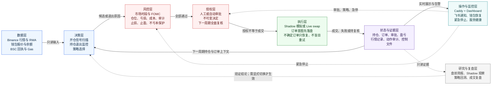

# Agentic Stock Bot 系统架构

本文描述当前代码和服务器部署实际形成的端到端链路，覆盖信号、策略、风控、审批、交易执行、失败恢复、监控、记录与离线研究。

> 当前生产语义：交易候选来自 Bot 内部行情扫描。飞书负责通知，也可作为可选的审批适配层，但不是独立的行情或交易信号源。盘前简报、Shadow 观察、策略回测和收盘复盘均为只读研究分支，不直接改变 Live 下单决策。

## 高度提炼架构图



这张图只保留系统最关键的闭环：**数据产生判断，风控决定是否允许，审批提供授权，执行产生真实状态，状态再反馈给下一轮决策。** Dashboard 和飞书位于操作监控面，不绕过风控直接交易；研究复盘位于只读证据面，不能自动改变 Live 策略。

## 详细总体架构图

```mermaid
flowchart TB
  subgraph EXT["① 外部数据与执行依赖"]
    BIN_ASSET["Binance RWA 资产目录<br/>官方股票代币、合约地址、市场状态"]
    BIN_KLINE["Binance 行情接口<br/>1m / 15m K线"]
    BIN_DYNAMIC["Binance RWA 动态数据<br/>代币价、参考资产价、basis"]
    BIN_AUDIT["Binance Token Audit<br/>风险命中、买卖税、支持状态"]
    BAW_READ["Agentic Wallet 只读命令<br/>状态、设置、余额、报价、订单查询"]
    BAW_SWAP["Agentic Wallet 状态变更命令<br/>market-order swap · BSC 56"]
    BSC_RPC["BSC RPC<br/>交易回执、Gas used、Gas price"]
    BNB_PRICE["BNB/USDT 行情<br/>Gas 折算为 USDT"]
    YAHOO["Yahoo 市场数据<br/>SPY、QQQ、IWM、VIX、期指、股票"]
    GDELT["GDELT 新闻<br/>宏观与事件风险标题"]
    FEISHU_API["飞书 API<br/>通知发送、可选消息轮询"]
  end

  subgraph RUNTIME["② 生产运行与安全边界"]
    SYSTEMD["systemd<br/>binance-agentic-stock-bot<br/>binance-agentic-dashboard"]
    BOT_GATE["Live 双门禁<br/>config.mode = live<br/>BOT_LIVE = 1"]
    DIRECT_NET["服务端直连网络<br/>显式清除 HTTP(S)/ALL_PROXY"]
    LOCK["单实例进程锁<br/>state/bot.lock"]
    ESTOP["持久紧急停止<br/>state/EMERGENCY_STOP"]
    CYCLE["Bot 60 秒主循环<br/>一个 cycleId 对应一轮完整审计"]
    PRIORITY{"本轮最高优先级"}
    PENDING_FIRST["1. 恢复或完成 pendingOrder"]
    APPROVAL_FIRST["2. 处理 approvalRequest"]
    POSITION_FIRST["3. 逐个监控全部持仓"]
    ENTRY_LAST["4. 扫描新开仓候选"]
  end

  subgraph SIGNAL["③ 信号生成与候选构建"]
    RESOLVE["解析当前官方 RWA 资产<br/>symbol → token contract"]
    STATUS["校验交易状态<br/>Binance marketStatus"]
    CANDLES["标准化已收盘 K线<br/>1m 方向序列 + 15m ATR(14)"]
    STRATEGY_SELECT["读取策略控制<br/>state/strategy-control.json"]
    MOMENTUM["adaptive-momentum<br/>15m 涨幅 ≥ 0.75 × ATR15<br/>15 个 1m 中至少 9 个上涨"]
    BASIS["basis-reversion<br/>可执行代币价相对参考资产折价"]
    CANDIDATE["构造候选<br/>symbol、合约、信号强度、ATR、策略"]
    RANK["候选排序<br/>仅从全部通过项中选择最高排名"]
    SCAN_RECORD["扫描记录<br/>含通过、拒绝及原因"]
  end

  subgraph ENTRY_RISK["④ BUY 开仓规则与风控门禁"]
    CAPACITY["仓位容量<br/>最多 3 个不同标的"]
    DAILY_LOSS["当日已实现净亏损上限<br/>达到 10 USDT 后禁止新开仓"]
    NYSE_SESSION["NYSE 会话计划<br/>常规时段、节假日、提前收市"]
    ENTRY_CUTOFF["收市前 45 分钟<br/>禁止新开仓"]
    FOMC["FOMC 决议日禁开仓<br/>13:50–15:15 ET"]
    SYMBOL_POLICY["标的策略<br/>黑名单、已持仓、30 分钟冷却<br/>同场 INITIAL_STOP 禁重入<br/>5 个交易日内二次止损则隔离"]
    EXEC_BUY_QUOTE["可执行 BUY 报价<br/>报价年龄 ≤ 10 秒"]
    COST_GATE["全成本覆盖<br/>往返报价损耗 + Gas + 执行缓冲<br/>往返损耗 ≤ 0.7%<br/>扣除成本后预期边际 ≥ 0.1%"]
    RISK_R["初始风险 R<br/>clamp(1.5 × ATR15, 1%, 3.5%)"]
    AUDIT_GATE["Token Audit<br/>无风险命中、买卖税 ≤ 5%<br/>官方 RWA 可走显式 unsupported 例外"]
    BALANCE_GATE["钱包 USDT 余额<br/>足以覆盖订单与成本"]
    BUY_ELIGIBLE["BUY 待审批快照<br/>金额、报价、合约、R、成本、审计"]
  end

  subgraph EXIT_RISK["⑤ 持仓监控与 SELL 风控"]
    EXACT_BALANCE["读取链上精确代币余额<br/>SELL 数量始终以当前余额为准"]
    EXEC_SELL_QUOTE["可执行 SELL 报价<br/>计算即时可回收 USDT"]
    EXCURSION["更新持仓轨迹<br/>峰值、MAE、MFE、最差报价"]
    EXIT_RULES{"动态退出规则"}
    INITIAL_STOP["INITIAL_STOP<br/>收益触及 -1R"]
    DISASTER_STOP["DISASTER_STOP<br/>收益触及 -8%"]
    PROFIT_PROTECT["利润保护与移动止损<br/>达到 +1R 后启用<br/>峰值 - 1 × 当前 ATR15<br/>保护线不低于全成本门槛"]
    FINAL_TP["最终止盈<br/>达到 +2R"]
    REVIEW_EXIT["4 小时复核退出<br/>原信号失效且进展不足 +0.5R"]
    BASIS_EXIT["Basis 归一化退出<br/>仅 basis-reversion"]
    NO_LOSS{"不亏本保护"}
    BLOCK_NON_STOP["非止损退出：若最坏回收<br/>不足本金 + 入场 Gas + 出场成本，则拦截"]
    STOP_OVERRIDE["INITIAL_STOP / DISASTER_STOP<br/>覆盖不亏本保护，允许止损"]
    SELL_ELIGIBLE["SELL 待审批快照<br/>全余额、退出原因、报价、预估盈亏"]
  end

  subgraph SHADOW["⑥ Shadow 观察层：只记录，不拦截 Live"]
    MARKET_REGIME["大盘趋势环境<br/>SPY / QQQ"]
    PULLBACK["趋势回撤确认"]
    TREND_QUALITY["趋势质量"]
    CONCENTRATION["持仓集中度"]
    ATR_SIZE["ATR 动态仓位建议"]
    EARLY_FAILURE["早期入场失败观察"]
    SHADOW_LOG["Shadow 标签与反事实结果"]
  end

  subgraph APPROVAL["⑦ 审批与二次校验"]
    APPROVAL_CREATE["创建 approvalRequest<br/>默认有效期 300 秒<br/>同一时刻仅保留一个审批"]
    AUTO_SWITCH["自动审批开关<br/>state/approval-control.json"]
    MANUAL_UI["Dashboard 人工审批<br/>确认审批编号 + 风险确认"]
    AUTO_RECORD["自动审批<br/>只写入批准决定，不立即下单"]
    IMMUTABLE_DECISION["不可变审批决定<br/>state/approval-decisions/{approvalId}.json"]
    APPROVAL_VALIDATE{"下一周期验证审批"}
    MATCH_CHECK["精确匹配<br/>方向、symbol、合约、数量、approvalId"]
    EXPIRE_CHECK["有效期、未复用、未被替换"]
    REQUOTE["重新拉取报价与审计<br/>校验报价漂移 ≤ maxQuoteDriftPct"]
    RECHECK_ALL["重新执行全部适用规则<br/>容量、会话、FOMC、成本、余额、退出条件"]
    APPROVED_ORDER["生成最终订单意图"]
    FAIL_CLOSED["Fail closed<br/>审批失效、条件变化或外部数据不可用<br/>均不执行交易"]
  end

  subgraph EXECUTION["⑧ 订单执行、恢复与记账"]
    MODE{"运行模式"}
    SHADOW_EXEC["Shadow<br/>模拟往返结果，不广播交易"]
    INTENT["先持久化 order intent<br/>state.pendingOrder = SUBMITTING"]
    SWAP_ONCE["调用 market-order swap<br/>slippage 配置值 · MEV on · Gas HIGH<br/>状态变更命令只调用一次"]
    SUBMIT_RESULT{"提交结果"}
    SUBMITTED["SUBMITTED<br/>轮询订单终态"]
    AMBIGUOUS["AMBIGUOUS<br/>超时或返回不确定"]
    RECONCILE["重启后按币对与时间窗<br/>查询订单历史并匹配 intent"]
    MATCH_COUNT{"匹配订单数量"}
    REVIEW_REQUIRED["REVIEW_REQUIRED<br/>0 笔或多笔匹配<br/>停止新订单，等待人工复核"]
    TERMINAL{"订单终态"}
    ORDER_FAILED["FAILED<br/>清理待处理状态并通知"]
    BUY_FINISHED["BUY FINISHED<br/>读取实际代币余额与 Gas<br/>新增持仓"]
    SELL_FINISHED["SELL FINISHED<br/>按 USDT 余额差计算实际回收<br/>计算毛盈亏、Gas、净盈亏<br/>移除持仓并更新冷却/止损历史"]
    GAS_ACCOUNTING["Gas 记账<br/>BSC 回执 × BNB/USDT<br/>无回执时用估算值<br/>累计 10 笔后用近 100 笔 P90"]
  end

  subgraph RECORDS["⑨ 状态、审计与证据"]
    BOT_STATE["state/bot-state.json<br/>持仓、已实现盈亏、pendingOrder、approvalRequest<br/>冷却、隔离、钱包状态、通知队列"]
    TRACE["state/action-trace.jsonl<br/>追加式、脱敏<br/>启动、周期、外部调用、决策、审批、订单、保存"]
    MARKET_DATA["state/market-data/YYYY-MM-DD.jsonl<br/>扫描行情、报价、规则和 Shadow 标签"]
    SIGNAL_HISTORY["state/dashboard-signal-history.jsonl<br/>Dashboard 信号历史"]
    WALLET_HISTORY["state/wallet-balance-history.json<br/>钱包余额历史"]
    CONTROL_FILES["控制文件<br/>strategy-control.json<br/>approval-control.json<br/>EMERGENCY_STOP + history"]
    JOURNAL["systemd journal<br/>进程输出、重启、timer 运行结果"]
  end

  subgraph OBSERVE["⑩ 操作、监控与通知"]
    CADDY["Caddy 公网入口<br/>TLS、压缩、安全响应头<br/>反向代理 127.0.0.1:4173"]
    AUTH["Dashboard 身份验证<br/>公网用户名/密码或会话层<br/>状态变更接口校验 Origin"]
    DASHBOARD["PC / iPhone Dashboard<br/>余额、钱包、模式、自动审批<br/>持仓、可执行盈亏、信号、订单、风控、审计"]
    CONTROL_API["控制 API<br/>策略切换、自动审批<br/>紧急停止/恢复、人工审批<br/>断线钱包 QR 登录"]
    SNAPSHOT_API["只读 API<br/>snapshot、策略验证、Shadow 结果<br/>交易复盘"]
    FEISHU_NOTIFY["飞书通知<br/>审批、提交、成交、失败、钱包告警<br/>附手机 Dashboard 链接"]
    NOTIFY_QUEUE["通知可靠性<br/>429/5xx/读失败重试<br/>失败后进入 pendingNotifications"]
    OPTIONAL_WATCH["可选/遗留 watch bridge<br/>轮询 Bot 发出的飞书消息<br/>匹配审批卡后调用 Dashboard API<br/>生产安装默认禁用"]
  end

  subgraph RESEARCH["⑪ 离线研究、验证与复盘：不进入下单主链路"]
    PREMARKET_TIMER["盘前 timer<br/>工作日 13:15 / 14:15 UTC"]
    PREMARKET["盘前研究简报<br/>Yahoo + GDELT<br/>NORMAL / SELECTIVE / DEFENSIVE / DATA_INSUFFICIENT"]
    VALIDATION_TIMER["策略验证 timer<br/>每日 22:30 UTC"]
    VALIDATION["策略验证与回测<br/>Binance token + Yahoo underlying<br/>当前策略与 Shadow 变体、30 天 forward"]
    SHADOW_OUTCOME["Shadow 结果归因<br/>读取 market-data 观察记录"]
    REVIEW_TIMER["收盘复盘 timer<br/>工作日 22:15 UTC"]
    TRADE_REVIEW["交易复盘<br/>从 trace 重建真实 SELL 成交<br/>真实与 Shadow 分离<br/>5/20 日汇总与市场归因"]
    RESEARCH_FILES["研究产物<br/>state/trade-reviews/*<br/>state/strategy-validation/*<br/>state/shadow-outcomes/latest.json"]
  end

  SYSTEMD --> BOT_GATE --> DIRECT_NET --> LOCK --> ESTOP --> CYCLE
  CYCLE --> PRIORITY
  PRIORITY --> PENDING_FIRST
  PRIORITY --> APPROVAL_FIRST
  PRIORITY --> POSITION_FIRST
  PRIORITY --> ENTRY_LAST

  BIN_ASSET --> RESOLVE
  BIN_KLINE --> CANDLES
  BIN_DYNAMIC --> BASIS
  RESOLVE --> STATUS --> CANDIDATE
  CANDLES --> MOMENTUM --> CANDIDATE
  STRATEGY_SELECT --> MOMENTUM
  STRATEGY_SELECT --> BASIS
  BASIS --> CANDIDATE
  ENTRY_LAST --> RESOLVE
  CANDIDATE --> CAPACITY --> DAILY_LOSS --> NYSE_SESSION --> ENTRY_CUTOFF --> FOMC --> SYMBOL_POLICY
  SYMBOL_POLICY --> EXEC_BUY_QUOTE --> COST_GATE --> RISK_R --> AUDIT_GATE --> BALANCE_GATE --> BUY_ELIGIBLE
  BAW_READ --> EXEC_BUY_QUOTE
  BAW_READ --> BALANCE_GATE
  BIN_AUDIT --> AUDIT_GATE
  BUY_ELIGIBLE --> RANK --> APPROVAL_CREATE
  CANDIDATE --> SCAN_RECORD

  POSITION_FIRST --> EXACT_BALANCE --> EXEC_SELL_QUOTE --> EXCURSION --> EXIT_RULES
  BAW_READ --> EXACT_BALANCE
  BAW_READ --> EXEC_SELL_QUOTE
  CANDLES --> EXIT_RULES
  EXIT_RULES --> INITIAL_STOP --> STOP_OVERRIDE
  EXIT_RULES --> DISASTER_STOP --> STOP_OVERRIDE
  EXIT_RULES --> PROFIT_PROTECT --> NO_LOSS
  EXIT_RULES --> FINAL_TP --> NO_LOSS
  EXIT_RULES --> REVIEW_EXIT --> NO_LOSS
  EXIT_RULES --> BASIS_EXIT --> NO_LOSS
  NO_LOSS -->|覆盖成本| SELL_ELIGIBLE
  NO_LOSS -->|不足| BLOCK_NON_STOP --> SCAN_RECORD
  STOP_OVERRIDE --> SELL_ELIGIBLE
  SELL_ELIGIBLE --> APPROVAL_CREATE

  CANDIDATE -.-> MARKET_REGIME
  CANDIDATE -.-> PULLBACK
  CANDIDATE -.-> TREND_QUALITY
  CANDIDATE -.-> CONCENTRATION
  CANDIDATE -.-> ATR_SIZE
  CANDIDATE -.-> EARLY_FAILURE
  MARKET_REGIME -.-> SHADOW_LOG
  PULLBACK -.-> SHADOW_LOG
  TREND_QUALITY -.-> SHADOW_LOG
  CONCENTRATION -.-> SHADOW_LOG
  ATR_SIZE -.-> SHADOW_LOG
  EARLY_FAILURE -.-> SHADOW_LOG

  APPROVAL_CREATE --> AUTO_SWITCH
  AUTO_SWITCH -->|关闭| MANUAL_UI --> IMMUTABLE_DECISION
  AUTO_SWITCH -->|开启| AUTO_RECORD --> IMMUTABLE_DECISION
  IMMUTABLE_DECISION --> APPROVAL_VALIDATE
  APPROVAL_FIRST --> APPROVAL_VALIDATE
  APPROVAL_VALIDATE --> MATCH_CHECK --> EXPIRE_CHECK --> REQUOTE --> RECHECK_ALL
  BAW_READ --> REQUOTE
  BIN_AUDIT --> REQUOTE
  RECHECK_ALL -->|仍满足| APPROVED_ORDER
  MATCH_CHECK -->|不匹配| FAIL_CLOSED
  EXPIRE_CHECK -->|过期或复用| FAIL_CLOSED
  REQUOTE -->|漂移或失败| FAIL_CLOSED
  RECHECK_ALL -->|条件变化| FAIL_CLOSED

  APPROVED_ORDER --> MODE
  MODE -->|shadow| SHADOW_EXEC --> BOT_STATE
  MODE -->|live| INTENT --> SWAP_ONCE
  PENDING_FIRST -->|SUBMITTED| SUBMITTED
  PENDING_FIRST -->|SUBMITTING / AMBIGUOUS| RECONCILE
  PENDING_FIRST -->|REVIEW_REQUIRED| FAIL_CLOSED
  BAW_SWAP --> SWAP_ONCE
  SWAP_ONCE --> SUBMIT_RESULT
  SUBMIT_RESULT -->|明确成功| SUBMITTED --> TERMINAL
  SUBMIT_RESULT -->|结果不确定| AMBIGUOUS --> RECONCILE --> MATCH_COUNT
  BAW_READ --> RECONCILE
  MATCH_COUNT -->|恰好 1 笔| SUBMITTED
  MATCH_COUNT -->|0 或多笔| REVIEW_REQUIRED --> FAIL_CLOSED
  TERMINAL -->|等待中| SUBMITTED
  TERMINAL -->|失败| ORDER_FAILED --> BOT_STATE
  TERMINAL -->|BUY 完成| BUY_FINISHED --> GAS_ACCOUNTING --> BOT_STATE
  TERMINAL -->|SELL 完成| SELL_FINISHED --> GAS_ACCOUNTING
  BSC_RPC --> GAS_ACCOUNTING
  BNB_PRICE --> GAS_ACCOUNTING

  CYCLE --> TRACE
  SCAN_RECORD --> MARKET_DATA
  SCAN_RECORD --> SIGNAL_HISTORY
  SHADOW_LOG --> MARKET_DATA
  APPROVAL_CREATE --> BOT_STATE
  INTENT --> BOT_STATE
  FAIL_CLOSED --> TRACE
  CYCLE --> WALLET_HISTORY
  AUTO_SWITCH --> CONTROL_FILES
  STRATEGY_SELECT --> CONTROL_FILES
  ESTOP --> CONTROL_FILES
  SYSTEMD --> JOURNAL

  CADDY --> AUTH --> DASHBOARD
  DASHBOARD --> CONTROL_API
  DASHBOARD --> SNAPSHOT_API
  CONTROL_API --> AUTO_SWITCH
  CONTROL_API --> STRATEGY_SELECT
  CONTROL_API --> ESTOP
  CONTROL_API --> MANUAL_UI
  CONTROL_API --> BAW_READ
  BOT_STATE --> SNAPSHOT_API
  TRACE --> SNAPSHOT_API
  MARKET_DATA --> SNAPSHOT_API
  SIGNAL_HISTORY --> SNAPSHOT_API
  WALLET_HISTORY --> SNAPSHOT_API
  CONTROL_FILES --> SNAPSHOT_API

  APPROVAL_CREATE --> FEISHU_NOTIFY
  SUBMITTED --> FEISHU_NOTIFY
  BUY_FINISHED --> FEISHU_NOTIFY
  SELL_FINISHED --> FEISHU_NOTIFY
  ORDER_FAILED --> FEISHU_NOTIFY
  FAIL_CLOSED --> FEISHU_NOTIFY
  FEISHU_NOTIFY --> FEISHU_API
  FEISHU_NOTIFY --> NOTIFY_QUEUE --> BOT_STATE
  FEISHU_API -.-> OPTIONAL_WATCH -.-> MANUAL_UI

  PREMARKET_TIMER -.-> PREMARKET
  YAHOO -.-> PREMARKET
  GDELT -.-> PREMARKET
  VALIDATION_TIMER -.-> VALIDATION
  BIN_KLINE -.-> VALIDATION
  YAHOO -.-> VALIDATION
  VALIDATION -.-> SHADOW_OUTCOME
  MARKET_DATA -.-> SHADOW_OUTCOME
  REVIEW_TIMER -.-> TRADE_REVIEW
  TRACE -.-> TRADE_REVIEW
  BOT_STATE -.-> TRADE_REVIEW
  PREMARKET -.-> TRADE_REVIEW
  PREMARKET -.-> RESEARCH_FILES
  VALIDATION -.-> RESEARCH_FILES
  SHADOW_OUTCOME -.-> RESEARCH_FILES
  TRADE_REVIEW -.-> RESEARCH_FILES
  RESEARCH_FILES -.-> SNAPSHOT_API

  classDef external fill:#eef6ff,stroke:#2563eb,color:#102a43;
  classDef decision fill:#fff7d6,stroke:#c89211,color:#4a3300;
  classDef safety fill:#fff0f0,stroke:#d13c3c,color:#5c1717;
  classDef execute fill:#edfcef,stroke:#238636,color:#103c1d;
  classDef store fill:#f4efff,stroke:#7048b5,color:#2f1c52;
  classDef observe fill:#effafa,stroke:#16858b,color:#123f42;
  classDef research fill:#f5f5f5,stroke:#777,color:#333;

  class BIN_ASSET,BIN_KLINE,BIN_DYNAMIC,BIN_AUDIT,BAW_READ,BAW_SWAP,BSC_RPC,BNB_PRICE,YAHOO,GDELT,FEISHU_API external;
  class PRIORITY,EXIT_RULES,NO_LOSS,APPROVAL_VALIDATE,MODE,SUBMIT_RESULT,MATCH_COUNT,TERMINAL decision;
  class BOT_GATE,ESTOP,CAPACITY,DAILY_LOSS,NYSE_SESSION,ENTRY_CUTOFF,FOMC,SYMBOL_POLICY,COST_GATE,AUDIT_GATE,BALANCE_GATE,STOP_OVERRIDE,FAIL_CLOSED,REVIEW_REQUIRED safety;
  class SWAP_ONCE,SUBMITTED,BUY_FINISHED,SELL_FINISHED,GAS_ACCOUNTING execute;
  class BOT_STATE,TRACE,MARKET_DATA,SIGNAL_HISTORY,WALLET_HISTORY,CONTROL_FILES,JOURNAL,RESEARCH_FILES store;
  class CADDY,AUTH,DASHBOARD,CONTROL_API,SNAPSHOT_API,FEISHU_NOTIFY,NOTIFY_QUEUE,OPTIONAL_WATCH observe;
  class MARKET_REGIME,PULLBACK,TREND_QUALITY,CONCENTRATION,ATR_SIZE,EARLY_FAILURE,SHADOW_LOG,PREMARKET_TIMER,PREMARKET,VALIDATION_TIMER,VALIDATION,SHADOW_OUTCOME,REVIEW_TIMER,TRADE_REVIEW research;
```



图中实线表示生产控制或数据流；虚线表示只读观察、研究或可选适配链路。红色节点是会阻断交易或要求人工介入的安全门禁，绿色节点会产生或完成交易状态变更。

## 主循环的严格优先级

每轮 `cycle()` 不是并行做所有事情，而是按安全优先级串行推进：

1. 检查持久紧急停止、钱包连接与余额，并冲刷上轮未发送成功的通知。
2. 如果存在 `pendingOrder`，只恢复、查询或完成该订单，不创建其他订单。
3. 如果存在 `approvalRequest`，只处理对应的不可变审批决定并重新校验。
4. 依次监控所有持仓；任一持仓形成待审批或待执行订单后，本轮停止继续创建新动作。
5. 在没有待处理订单和审批时，才允许扫描新开仓信号。
6. 保存状态、写入 action trace；任何关键读取失败都按 fail closed 处理。

这保证系统在任意时刻最多有一个审批或订单处于推进状态，避免余额竞争、重复下单和重启后的状态分叉。

## BUY 开仓链路

| 阶段 | 输入 | 关键规则 | 输出 |
| --- | --- | --- | --- |
| 资产解析 | 配置的 symbol 列表 | 必须解析为当前官方 RWA 合约 | 可扫描资产 |
| 信号生成 | 已收盘 1m/15m K线 | 默认策略要求 `15m return >= 0.75 × ATR15`，且 15 个 1m 中至少 9 个上涨 | 带强度和 ATR 的候选 |
| 账户级风控 | 当前状态 | 最多 3 个标的；当日净亏损达到 10 USDT 后停止开仓 | 有容量的候选 |
| 市场时间 | NYSE 日历和 Binance 状态 | 仅常规盘；提前收市适配；收市前 45 分钟禁止开仓；FOMC 日 13:50–15:15 ET 禁止开仓 | 时间合法候选 |
| 标的策略 | 持仓、冷却和止损历史 | 不重复持仓；退出后冷却 30 分钟；同场初始止损后禁止重入；短期二次初始止损进入隔离 | 标的合法候选 |
| 可执行成本 | BAW BUY/SELL 报价、Gas 估算 | 报价新鲜；往返报价损耗不高于 0.7%；全成本后预期边际至少 0.1% | 有成本余量的候选 |
| 风险参数 | ATR15 | `R = clamp(1.5 × ATR15, 1%, 3.5%)`，最终止盈为 `+2R` | 固化风险快照 |
| 合约安全 | Binance Token Audit | 风险命中为零、买卖税不高于 5%；官方 RWA unsupported 只能走显式确认例外 | 审计通过 |
| 资金 | 钱包 USDT | 足以覆盖订单金额和预估成本 | BUY 待审批快照 |
| 排序 | 所有通过候选 | 从已通过门禁的候选中选最高排名 | 单个 approvalRequest |

## SELL 持仓管理链路

退出监控不受 FOMC 禁开仓窗口、开仓截止时间和“只允许常规盘开仓”限制；这些限制只针对 BUY。每分钟对每个持仓读取精确链上余额和可执行 SELL 报价，然后按当前风险状态重新计算：

| 退出类型 | 触发条件 | 是否受“不亏本卖出”保护拦截 |
| --- | --- | --- |
| `INITIAL_STOP` | 收益触及 `-1R` | 否。止损优先，允许亏损退出 |
| `DISASTER_STOP` | 收益触及 `-8%` | 否。灾难止损优先 |
| 利润保护/移动止损 | 达到 `+1R` 后，价格从峰值回撤至动态保护线 | 是 |
| `FINAL_TAKE_PROFIT` | 收益达到 `+2R` | 是 |
| 四小时复核 | 原入场信号失效且进展不足 `+0.5R` | 是 |
| Basis 归一化 | basis-reversion 的价差达到退出条件 | 是 |

“不亏本保护”以最坏可执行回收额核算本金、入场 Gas、预估出场 Gas 和滑点。它只拦截非止损退出，不会阻止 `INITIAL_STOP` 或 `DISASTER_STOP`。

退出信号在审批后二次校验时会重新计算。当前实现不是锁存式止损：如果审批等待期间报价恢复、原退出条件已不成立，本次 SELL 会取消而不是按旧信号强行卖出。

## 审批不是成交

`AUTO APPROVAL QUEUED` 只表示系统已经写入了一份不可变的批准决定，绝不等同于已提交或已成交。下一轮仍会：

1. 校验审批编号、方向、symbol、合约地址和数量是否与当前请求完全一致。
2. 校验审批是否过期、是否已使用或被其他请求替换。
3. 重新获取报价、安全审计和余额。
4. 对 BUY 重新执行容量、交易时段、FOMC、标的策略和成本门禁。
5. 对 SELL 重新确认精确持仓余额、退出条件和不亏本保护的适用性。
6. 只有所有条件仍然成立，才创建 `pendingOrder` 并进入执行阶段。

因此用户侧应按以下状态理解：

```text
APPROVAL REQUIRED
  → AUTO APPROVAL QUEUED / 人工批准
  → 下一周期重新校验
  → SUBMITTED
  → FINISHED 或 FAILED
```

## 订单恢复与“绝不盲目重试”

读操作可以在瞬时网络故障时有限重试，但 `market-order swap` 是状态变更操作，只调用一次：

- 调用前先把完整 order intent 写入 `state.pendingOrder`，状态为 `SUBMITTING`。
- 得到明确订单号后进入 `SUBMITTED`，随后只轮询订单状态。
- 提交超时或结果不确定时进入 `AMBIGUOUS`，不再次调用 swap。
- 重启后按交易对和时间窗口查询订单历史：
  - 恰好匹配一笔：接管该订单并继续轮询。
  - 匹配零笔或多笔：进入 `REVIEW_REQUIRED`，停止新订单，等待人工核查。

这一设计优先避免重复成交，即使代价是极端情况下需要人工解除不确定状态。

## 状态与审计文件

| 路径 | 内容 | 写入者 | 主要读取者 |
| --- | --- | --- | --- |
| `config.json` | 模式、标的、仓位、成本、时段、止损、审批等静态配置 | 运维 | Bot、Dashboard、定时任务 |
| `/etc/binance-agentic-stock-bot.env` | Live 门禁、Dashboard 凭据、飞书凭据等秘密 | 运维/root | systemd 服务 |
| `/var/lib/binance-agentic-stock-bot/.baw` | Agentic Wallet 会话 | BAW / Dashboard QR 登录 | Bot、Dashboard |
| `state/bot-state.json` | 持仓、净盈亏、Gas、订单、审批、冷却、隔离、钱包状态、通知队列 | Bot | Bot、Dashboard、复盘 |
| `state/action-trace.jsonl` | 追加式脱敏动作轨迹 | Bot、Dashboard 控制 API | Dashboard、交易复盘 |
| `state/market-data/YYYY-MM-DD.jsonl` | 每轮行情、报价、规则决定和 Shadow 标签 | Bot | Shadow 结果、策略研究 |
| `state/dashboard-signal-history.jsonl` | Dashboard 展示的近期扫描信号 | Dashboard 聚合层 | Dashboard |
| `state/wallet-balance-history.json` | 钱包余额快照 | Bot | Dashboard |
| `state/approval-control.json` | 自动审批开关 | Dashboard | Bot、Dashboard |
| `state/approval-decisions/<approvalId>.json` | 不可变人工或自动审批决定 | Dashboard / Bot | Bot |
| `state/strategy-control.json` | 当前入场策略 | Dashboard | Bot |
| `state/EMERGENCY_STOP` | 跨重启保留的紧急停止标记 | CLI / Dashboard | Bot |
| `state/emergency-stop-history/` | 已解除紧急停止的归档 | Dashboard / CLI | 审计 |
| `state/trade-reviews/` | 盘前简报、日复盘、索引和汇总 | timer 任务 | Dashboard |
| `state/strategy-validation/` | 数据集、日回测、forward 观察和循环状态 | timer 任务 | Dashboard、研究 |
| `state/shadow-outcomes/latest.json` | Shadow 规则的后验结果 | timer 任务 | Dashboard、研究 |
| systemd journal | 服务启动、异常、自动重启和 timer 结果 | systemd | 运维 |

## Dashboard 与公网边界

生产拓扑只有 Caddy 对公网开放：

```text
公网 HTTPS
  → Caddy：TLS、压缩、安全响应头、身份验证边界
  → 127.0.0.1:4173 Dashboard
  → 读取 state / trace / reports
  → 经受保护 API 写入审批和控制文件
```

Dashboard 的状态变更接口还会校验请求 `Origin`。主要接口分为：

- 只读：`/api/snapshot`、`/api/strategy-validation`、`/api/shadow-outcomes`、`/api/trade-reviews`。
- 控制：`/api/auto-approval`、`/api/strategy`、`/api/emergency-stop`、`/api/emergency-resume`。
- 审批：`/api/approval-decision`。
- 钱包恢复：`/api/wallet-login/start`、`/api/wallet-login/status`，用于断开后在手机端快速扫码。

Dashboard 展示的是状态和可执行报价的聚合视图，不直接绕过 Bot 调用 swap。审批、自动审批和策略切换都必须先落盘，再由 Bot 下一周期读取和校验。

## 飞书链路的准确定位

生产主链路是：

```text
Bot 内部扫描 / 持仓风控
  → 创建审批或订单事件
  → 飞书通知
  → 用户打开手机 Dashboard 查看
  → 人工审批，或由 Bot 自动审批控制直接记录决定
```

`watch/watcher.mjs` 能轮询 Bot 已发送到飞书的消息，再匹配 Dashboard 上同一个审批编号并调用审批接口。它没有生成新的交易观点，只是把“Bot 通知”转换为“Dashboard 批准”的可选适配器。服务器安装流程默认禁用这个遗留 watch 服务，避免形成重复审批通路。

## 离线研究与生产交易的隔离

| 任务 | 调度 | 数据 | 产物 | 对 Live 执行的影响 |
| --- | --- | --- | --- | --- |
| 盘前简报 | 工作日 13:15、14:15 UTC | Yahoo、GDELT | `state/trade-reviews/premarket/` | 无，只读研究 |
| 收盘交易复盘 | 工作日 22:15 UTC | trace、Bot state、盘前简报、外部市场 | 日报、5/20 日汇总、市场归因 | 无，只读复盘 |
| 策略验证 | 每日 22:30 UTC | Binance token K线、Yahoo underlying | 当前策略与变体回测、30 天 forward | 无，不切换策略 |
| Shadow outcome | 跟随策略验证 | `state/market-data` | 各 Shadow 规则的后验效果 | 无，只提供观察证据 |

这些任务使用独立的 systemd oneshot 服务，清除代理环境，仅写入各自的研究目录；不会读取钱包秘密去下单，也不会写审批、持仓或订单状态。

## 代码模块索引

| 责任 | 主要文件 |
| --- | --- |
| 60 秒主循环、行情调用、候选扫描、审批重验、执行与成交入账 | [`src/bot.mjs`](../src/bot.mjs) |
| 入场时段、FOMC、成本、审计、信号和通用策略规则 | [`src/strategy.mjs`](../src/strategy.mjs) |
| 动态退出规则 | [`src/strategy-exit.mjs`](../src/strategy-exit.mjs) |
| 策略选择与 basis 逻辑 | [`src/strategy-lab.mjs`](../src/strategy-lab.mjs) |
| 多持仓状态与容量 | [`src/position-state.mjs`](../src/position-state.mjs) |
| 不亏本保护、Gas 和已实现盈亏 | [`src/execution-accounting.mjs`](../src/execution-accounting.mjs) |
| 订单意图、报价新鲜度、恢复和故障状态 | [`src/reliability.mjs`](../src/reliability.mjs) |
| 不可变审批决定 | [`src/approvals.mjs`](../src/approvals.mjs) |
| 动作审计 | [`src/trace.mjs`](../src/trace.mjs) |
| 市场记录 | [`src/market-data-recorder.mjs`](../src/market-data-recorder.mjs) |
| Dashboard 服务和控制 API | [`scripts/serve-live-dashboard.mjs`](../scripts/serve-live-dashboard.mjs) |
| Dashboard 聚合快照 | [`src/dashboard.mjs`](../src/dashboard.mjs) |
| 飞书通知内容 | [`src/feishu-message.mjs`](../src/feishu-message.mjs) |
| 可选飞书审批适配器 | [`watch/watcher.mjs`](../watch/watcher.mjs)、[`watch/dashboard-bridge.mjs`](../watch/dashboard-bridge.mjs) |
| 市场环境研究 | [`src/market-context.mjs`](../src/market-context.mjs) |
| 收盘复盘 | [`src/trade-review.mjs`](../src/trade-review.mjs) |
| 策略回测 | [`src/strategy-backtest.mjs`](../src/strategy-backtest.mjs) |
| 生产服务、timer 和 Caddy 示例 | [`deploy/`](../deploy/) |

## 当前设计的关键安全结论

1. **自动审批不等于自动成交。** 审批只是下一周期重新校验的授权输入。
2. **只重试读操作，不重试不确定的 swap。** 订单不确定时优先进入人工复核，防止重复成交。
3. **止损可以亏损退出。** “不要亏本卖出”只保护非止损退出，不拦 `INITIAL_STOP` 和 `DISASTER_STOP`。
4. **FOMC 和交易时段门禁只限制新开仓。** 持仓监控、止损、止盈和平仓继续运行。
5. **Shadow 与研究不干预 Live。** 它们只积累证据，策略切换必须由独立控制文件显式完成。
6. **飞书不是第二套交易引擎。** 它是通知渠道，可选 watch 只是审批适配器。
7. **单订单串行化。** 一个 pending order 或 approval 未结束前，不创建第二个交易动作。
8. **所有关键动作可追溯。** 状态、审批、报价、拒绝原因、订单恢复、成交和 Gas 都进入文件证据或 systemd journal。
