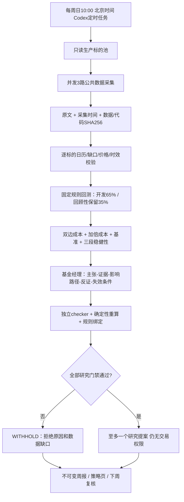

# 周度基金经理研究模块

## 当前交付边界

目标不是每周硬给一只股票，而是每周生成一份可审计的策略建议报告。允许 WITHHOLD（没有可采纳的调整）；只允许一个 PAPER_RESEARCH_PROPOSAL（还需审阅与发布后验证），没有任何到实盘执行的写入路径。独立于现有基金经理日报。

策略页顶部提供周报状态和 `/weekly-strategy` 入口，六维分析、全池候选表、回测口径、拒绝原因、来源及版本均可查看。报告历史不可覆盖；最新失败报告仍显示，上次完整报告可追溯，不伪造 Last Known Good 的时间。当前代码是否已上生产须以本次部署验收为准。

## 证据矩阵

| 维度 | 首版数据 | 门槛及局限 |
| --- | --- | --- |
| 宏观 | FRED FEDFUNDS/CPIAUCSL/UNRATE、美联储新闻源 | 月度值允许65日；观测期不等于发布时间，当前 vintage 不进历史回测 |
| 黄金 | GLD 六年复权日线 | GLD是黄金ETF代理，不是实时现货黄金；池外只用作宏观参考 |
| 债市 | TLT、DGS2/DGS10/DFII10 | 收益率允许7日；债券ETF价格不是债券到期收益率 |
| 政治事件 | 白宫原始新闻源、经理核查原文与反证 | 30日内源发现不等于重大事件全覆盖；不因单一官方叙事而忽略矛盾 |
| 预测市场 | Gamma活跃市场前300高成交量记录 | 关键词相关、未结束、24h内更新、流动性≥1万美元、24h成交≥1000美元、买卖差≤0.10、二元结算条件、按事件去重；价格不等于真实概率 |
| 技术 | 生产全池 + SPY/QQQ上下文日线 | 正数、排序/重复、历史长度、逐标的覆盖、完成时点；未通过保留拒绝项 |

公开源限制、访问失败、供给方修订都作为显式状态，不回退成0。新闻无法用机械字段校验证明完整或可信，经理和独立检查员仍须核查原文。

## 回测与策略工件

第一版有两个预先固定的**研究基线**，各自在池内每个标的上运行：

- daily-momentum-20-60：前收盘>SMA60且20日动量>0，次日开盘入场；条件失效次日开盘退出。
- daily-close-breakout-55-20：前收盘突破此前55日收盘高点，次日开盘入场；前收盘跌破此前20日收盘低点，次日开盘退出。

两者都是每日检查、单仓、无杠杆、虚拟独立资金全额复利。不是对现有15分钟自适应动量及高低价/ATR海龟的复现，不能借用后者名字或实盘业绩。后续扩充规则须先冻结版本与测试，再采集下一期工件，不能根据本期保留段反复试参。

成本基线为单边50bps、压力100bps，入场/退出/结束估值平仓均扣费。这是研究假设，不是假装测得的代币执行全成本；真实双向报价、gas、multiplier、夜间流动性、执行漂移仍未验证。净值回撤与逐笔净金额PF相配；终端强制结算不增加规则闭合样本数。

前65%/后35%是回顾性时间切分，不是独立发布后样本外，不给“90%把握”等伪概率。所有候选都记录，不能只保存赢家。底层复权数据有修订/幸存者偏差；宏观与政治材料只解释当前情景，不回填历史因子。

准入：每标的≥756根、98%日历覆盖；保留段≥252日、20个规则闭合交易、净金额PF≥1.2、净收益>0且超过同标的基准、最大回撤≤15%；加倍成本盈利；3个子窗口至少2个盈利。这是待前向验证的研究筛选标准，不是自动启用策略的授权。

## 工件与执行

`state/weekly-research/周一日期/` 保存 raw.json、history.json、bundle.json、analysis-template.json、analysis.json、report.json、report.html，并可附运行记录 operation.md。bundle冻结前先写底层数据，发布时重验SHA256与代码版本并重算候选；模型不能改 passed 或把未回测规则写成已验证提案。recollect仅用于未出正式报告的采集重试，原快照保留在attempts；正式报告不可覆盖。

已建立Codex周度任务 `automation-2`，每周日北京时间10:00执行。本地任务需要Mac/Codex可运行及账户额度可用；它不是VPS内的常驻模型服务。当前首版页面尚未部署到生产。

命令与周度提示词见 `roles/fund-manager/WEEKLY.md`。不增加付费API依赖，仅标准库和现有curl/ssh。采集并发3、每源最多一次重试、请求有超时。每日角色/生产状态和其他工作树改动均保留。

## 借鉴 Minara 的部分

采用 [Minara调研](2026-09-13-minara-harness-deep-research.md) 中的证据manifest、主张绑定、不可变工件、独立复核、研究与执行隔离、失败可见。未接入Minara交易或托管权限，也不把多Agent投票当作收益证明。

数据接口参考：[Polymarket官方市场数据](https://docs.polymarket.com/market-data/overview)、[美联储RSS](https://www.federalreserve.gov/feeds/feeds.htm)、[NYSE日历](https://www.nyse.com/markets/hours-calendars)、[Codex定时任务](https://learn.chatgpt.com/docs/automations?surface=app)。
